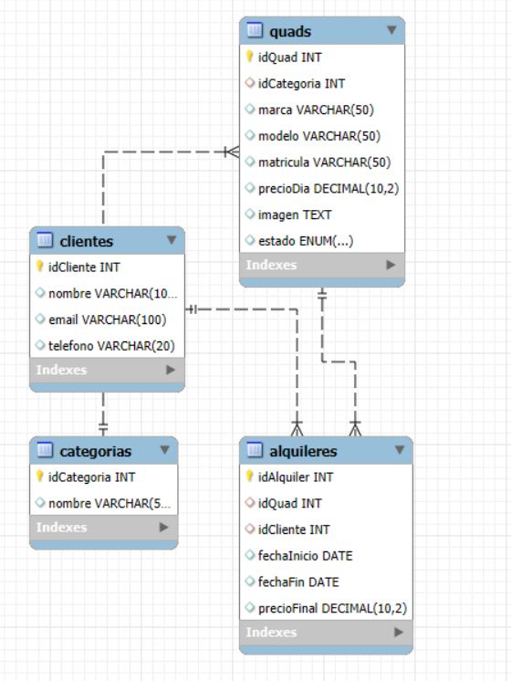
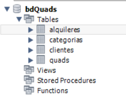

--Descripción de la aplicación:

Allande Aventuras es una aplicación web de gestión de alquiler de quads.
Permite administrar el inventario de quads, los clientes, los alquileres
y las rutas disponibles. Controla la disponibilidad de los quads por fechas,
calcula el precio automáticamente y muestra el historial de alquileres
por quad y por cliente.

--Diagrama ER de MySQL:

--Captura Tablas de Workbench:

--Diseño Esquema Mongo DB:

{
  "$schema": "https://json-schema.org/draft/2020-12/schema",
  "type": "object",
  "required": [
    "_id",
    "__v",
    "dificultad",
    "imagen",
    "kms",
    "nombre"
  ],
  "properties": {
    "_id": {
      "$ref": "#/$defs/ObjectId"
    },
    "__v": {
      "type": "integer"
    },
    "dificultad": {
      "type": "string"
    },
    "imagen": {
      "type": "string"
    },
    "kms": {
      "type": "integer"
    },
    "nombre": {
      "type": "string"
    }
  },
  "$defs": {
    "ObjectId": {
      "type": "object",
      "properties": {
        "$oid": {
          "type": "string",
          "pattern": "^[0-9a-fA-F]{24}$"
        }
      },
      "required": [
        "$oid"
      ],
      "additionalProperties": false
    }
  }
}

-- Listado de todas las rutas:

/                                          ---> Menú principal

/dashboard                                 ---> Estadísticas generales

/quads                                     ---> Listado de quads con 3 filtros

/quads/nuevoQuad                           ---> Formulario crear quad

/quads/[idQuad]                            ---> Ficha del quad y el historial de alquileres

/quads/[idQuad]/editarQuad                 ---> Formulario editar quad

/clientes                                  ---> Listado de clientes con filtros

/clientes/nuevoCliente                     ---> Formulario crear cliente

/clientes/[idCliente]                      ---> Ficha del cliente junto con sus alquileres

/clientes/[idCliente]/editarCliente        ---> Formulario editar cliente

/alquileres                                ---> Listado de alquileres con filtros

/alquileres/nuevoAlquiler                  ---> Formulario crear alquiler

/alquileres/[idAlquiler]                   ---> Ficha del alquiler

/alquileres/[idAlquiler]/editarAlquiler    ---> Formulario editar alquiler

/categorias                                ---> Listado de categorías con editar y eliminar

/categorias/nuevaCategoria                 ---> Formulario crear categoría

/categorias/[idCategoria]/editar           ---> Formulario editar categoría

/rutas                                     ---> Listado de rutas MongoDB con 2 filtros

/rutas/nuevaRuta                           ---> Formulario crear ruta

/rutas/[idRuta]                            ---> Ficha de la ruta

/rutas/[idRuta]/editarRuta                 ---> Formulario editar ruta

--Justificación del uso de MongoDB:

La colección "rutas" se almacena en MongoDB porque su estructura es flexible,
cada ruta puede tener campos distintos según su tipo. En un futuro, puede que alguna de las  
rutas que se almacene tengan datos que solo sean propios de ellas, por lo que usar Mongo
me proporciona  una libertad al no tener un esquema relacional fijo como en MySQL